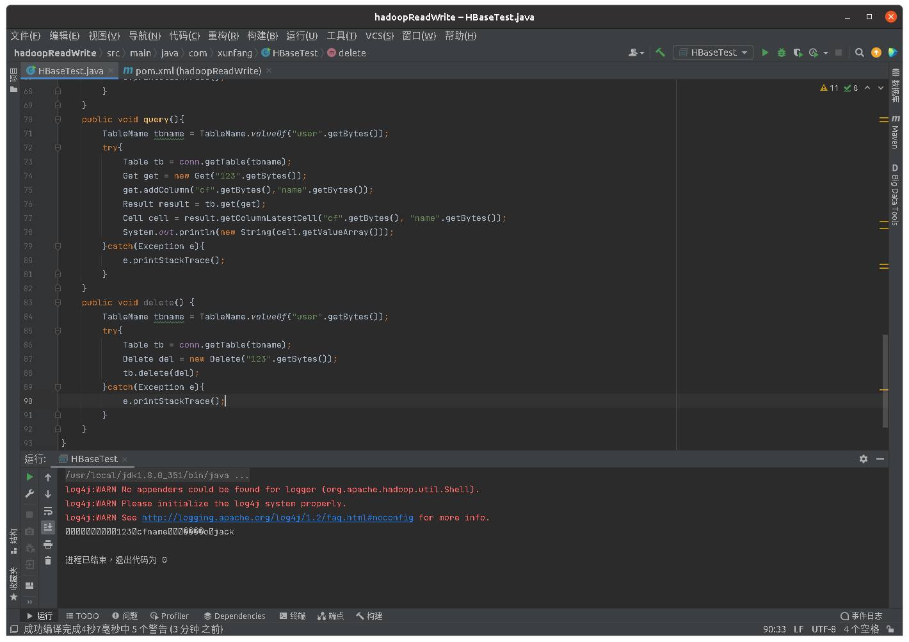

# Hadoop实验之HBase

## 实验一：安装与配置

（一）HBase安装
进入install_pack目录查看Hive压缩包

```bash
cd /usr/local/install_pack/
ls -lrt
```

解压Hbase压缩包

```bash
tar -zxvf hbase-2.2.3-bin.tar.gz -C /usr/local/software/
```

进程software目录查看解压好的文件

```bash
cd /usr/local/software
ls -l
```

（二）配置安装Hbase
修改HBase的配置文件hbase-env.sh

```bash
cd /usr/local/software/hbase-2.2.3/conf
vim hbase-env.sh
```

在文件末尾追加下述内容

```bash
export JAVA_HOME=/usr/local/software/jdk1.8.0_351
export HBASE_MANAGES_ZK=flase
```

修改HBase的配置文件hbase-site.xml

```bash
cd /usr/local/software/hbase-2.2.3/conf
vim hbase-site.xml
```

在configuration标签间添加下述配置
```xml
<property>
    <name>hbase.rootdir</name>
    <value>hdfs://master:8020/hbase</value>
</property>
<property>
    <name>hbase.cluster.distributed</name>
    <value>true</value>
</property>
<property>
    <name>hbase.zookeeper.quorum</name>
    <value>master,slave1,slave2</value>
</property>
<property>
    <name>hbase.master.maxclockskew</name>
    <value>2700000</value>
</property>
<property>
    <name>hbase.tmp.dir</name>
    <value>/usr/local/software/hbase-2.2.3/data/tmp</value>
</property>
<property>
    <name>zookeeper.znode.parent</name>
    <value>/hbase/master</value>
</property>
<property>
    <name>hbase.unsafe.stream.capability.enforce</name>
    <value>false</value>
</property>
```

新建一个放临时文件的文件夹，此处新建的文件为配置文件里面配置的路径

```bash
mkdir -p /usr/local/software/hbase-2.2.3/data/tmp
```

在HDFS文件系统新建文件夹hbase，此处新建的HDFS文件为配置文件里面配置的路径

```bash
hadoop fs -mkdir /hbase
```

将hadoop中hdfs-site.xml拷贝到HBASE_HOME/conf下

```bash
cp /usr/local/software/hadoop-3.2.1/etc/hadoop/hdfs-site.xml /usr/local/software/hbase-2.2.3/conf/
```

修改HBase的配置文件配置regionservers

```bash
vim /usr/local/software/hbase-2.2.3/conf/regionservers
```

删除里面的内容，添加slave1、slave2的主机名

```
slave1
slave2
```

Hbase配置HA，新建backup-masters文件,

```bash
cd /usr/local/software/hbase-2.2.3/conf
vim backup-masters
```

添加slave1的主机名

```
slave1
```

把整个hbase安装目录发送给子节点，slave1与slave2

```bash
cd /usr/local/software
xsync /usr/local/software/hbase-2.2.3
```

配置HBASE_HOME三个节点都需要

```
vim /etc/profile
```

将下述内容追加进文件末尾

```bash
# 配置HBASE_HOME
export HBASE_HOME=/usr/local/software/hbase-2.2.3
export PATH=$PATH:$HBASE_HOME/bin
```

加载设置三个节点都需要

```bash
source /etc/profile
```

## 实验二：数据的导入

### （一）环境准备
启动集群（master节点运行）（如果已启动则不需要再运行下列命令）

```bash
zk start
start-all.sh
start-hbase.sh
```

查看进程

```bash
xcall jps
```

启动Hbsee Shell

```bash
hbase shell
```

### （二）数据准备
新建数据文件夹（文件夹已存在就不需要创建）

```bash
mkdir /usr/local/software/hbase-2.2.3/data
cd /usr/local/software/hbase-2.2.3/data
```

创建测试数据

```bash
vim f.csv
```

将下列内容输入文件中

```
1,"aaa"
2,"bbb"
3,"ccc"
4,"ddd"
5,"eee"
```

将文件上传到hdfs文件系统

```bash
hadoop fs -mkdir -p /data/hbase/case	
hadoop fs -put /usr/local/software/hbase-2.2.3/data/f.csv /data/hbase/case
```

### （三）使用importTsv功能将csv文件数据导入HBase
启动Hbsee Shell

```bash
hbase shell
```

hbase中创建要导入数据的表

```shell
create 'test' , 'f1'
```

数据导入(需要打开另一个终端)

```bash
hbase org.apache.hadoop.hbase.mapreduce.ImportTsv -Dimporttsv.separator="," -Dimporttsv.columns=HBASE_ROW_KEY,f1 test /data/hbase/case/f.csv
```

MapReduce执行成功之后会显示下图结果：

查看导入HBase中的数据

```shell
scan 'test'
```

### （四）使用import功能，将数据导入HBase
使用import功能进行数据导入，导入的文件必须是sequence文件。与import相对的还有export功能，export功能导出的文件为sequence文件。
使用export功能将HBase表中的数据导出，代码如下：(需要打开另一个终端)

```bash
hbase org.apache.hadoop.hbase.mapreduce.Export test /output/hbase/data
```

查看得到的结果：(需要打开另一个终端)

```bash
hadoop fs -ls /output/hbase/data
```

创建表：

```shell
create 'test2','f1'
```

执行import的MapReduce导入数据(需要打开另一个终端)

```bash
hbase org.apache.hadoop.hbase.mapreduce.Import test2 /output/hbase/data
```

查看HBase表中的数据

```shell
scan 'test2'
```

### （五）使用BulkLoad功能将，数据导入HBase
通过importTsv生成HFile文件(需要打开另一个终端)

```bash
hbase org.apache.hadoop.hbase.mapreduce.ImportTsv -Dimporttsv.separator="," -Dimporttsv.bulk.output=/output/hbase/data1 -Dimporttsv.columns=HBASE_ROW_KEY,f1 test3 /data/hbase/case/f.csv
```

此过程会主动创建HBase表和HDFS上对应的目录

将数据导入到HBase表中(需要打开另一个终端)

```bash
hbase org.apache.hadoop.hbase.mapreduce.LoadIncrementalHFiles /output/hbase/data1 test3
```

查看test3表

```shell
scan 'test3'
```

补充：HBase Table DDL

1. 创建表

```shell
create 'table name','column family'
# create '[表名]','[列簇名]'
# 例：
create 'test' , 'f1'
```

2. 插入/更新操作

```shell
put 'table name','row','column family: column name', 'value'
# put '[表名]','[行键]','[列簇名]: [列名]', '[值]'
# 例：
put 'test','6','f1:','"fff"'
```

3. 删除操作

删除一条数据

```shell
delete 'table name', 'row', 'column family: column name', 'timestamp'
# delete '[表名]','[行键]','[列簇名]: [列名]','[时间戳]'
delete 'test','6','f1:'
```

删除表
      先用“disable”让表变为禁用状态，然后进行删除操作。若表不是禁用状态，无法删除。
```shell
disable 'table name'
drop 'table name'
```

## 实验三：API使用

### （一）新建maven工程
打开IDEA2020.1，点击Create New Project

选择Maven，点击Next

点击Artifact[工件坐标]前的下箭头，在弹出的内容处更改组ID与工件ID

```
com.xunfang
hadoopReadWrite
```

点击完成

配置pom文件

```xml
    <dependencies>
        <dependency>
            <groupId>org.apache.hbase</groupId>
            <artifactId>hbase-shaded-client</artifactId>
            <version>2.2.3</version>
        </dependency>
        <dependency>
            <groupId>org.apache.hbase</groupId>
            <artifactId>hbase-client</artifactId>
            <version>2.2.3</version>
        </dependency>
        <dependency>
            <groupId>org.apache.hbase</groupId>
            <artifactId>hbase-server</artifactId>
            <version>2.2.3</version>
        </dependency>
        <dependency>
            <groupId>org.apache.zookeeper</groupId>
            <artifactId>zookeeper</artifactId>
            <version>3.5.6</version>
        </dependency>
        <dependency>
            <groupId>org.apache.hadoop</groupId>
            <artifactId>hadoop-common</artifactId>
            <version>3.2.1</version>
        </dependency>
    </dependencies>
    <build>
        <plugins>
            <plugin>
                <groupId>org.apache.maven.plugins</groupId>
                <artifactId>maven-compiler-plugin</artifactId>
                <version>3.1</version>
                <configuration>
                    <source>1.8</source>
                    <target>1.8</target>
                    <testExcludes>
                        <testExclude>/src/test/**</testExclude>
                    </testExcludes>
                    <encoding>utf-8</encoding>
                </configuration>
            </plugin>
            <plugin>
                <groupId>org.apache.maven.plugins</groupId>
                <artifactId>maven-assembly-plugin</artifactId>
                <version>2.2-beta-5</version>
                <configuration>
                    <descriptorRefs>
                        <descriptorRef>jar-with-dependencies</descriptorRef>
                    </descriptorRefs>
                </configuration>
                <executions>
                    <execution>
                        <id>make-assembly</id> <!-- this is used for inheritance merges -->
                        <phase>package</phase> <!-- 指定在打包节点执行jar包合并操作 -->
                        <goals>
                            <goal>single</goal>
                        </goals>
                    </execution>
                </executions>
            </plugin>
        </plugins>
    </build>
```

加载Maven变更

```Ctrl+shift+O```

### （二）编写代码
新建一个HBaseTest类，位于src/main/java/com/xunfang/目录下

HBaseTest.java

```java
package com.xunfang;
import org.apache.hadoop.conf.Configuration;
import org.apache.hadoop.hbase.*;
import org.apache.hadoop.hbase.client.*;
import java.io.IOException;

public class HBaseTest {
    public static void main(String[] args) {
        HBaseTest hbase = new HBaseTest();
        hbase.connHbase();//建立连接
        hbase.createTable("user","cf");//创建表
        hbase.insert();//插入数据
        hbase.query();//查询数据
        //hbase.delete();
    }
    Connection conn=null;
    public void connHbase(){
        Configuration config = HBaseConfiguration.create();
        config.set("hbase.zookeeper.quorum", "master,slave1,slave2");
        config.set("zookeeper.znode.parent","/hbase/master");
        config.set("hbase.zookeeper.property.clientPort","2181");
        try {
            conn = ConnectionFactory.createConnection(config);
        } catch (IOException e) {
            e.printStackTrace();
        }
    }
    /**
     * 利用create 'tablename','列簇'
     * hbase里面所有数据都是以二进制数组形式存放，所以都需要getBytes
     * @throws IOException
     */
    public void createTable(String tableName,String columnFamily){
        Admin admin;
        try {
            admin = conn.getAdmin();
            TableName table = TableName.valueOf(tableName.getBytes());
            if(admin.tableExists(table)){
                //删除表之前要disable
                admin.disableTable(table);
                admin.deleteTable(table);
            }
            HTableDescriptor tabledesc = new HTableDescriptor(table);
            HColumnDescriptor columndesc = new HColumnDescriptor("cf".getBytes());
            columndesc.setBlockCacheEnabled(true);
            columndesc.setBlocksize(64000);
            tabledesc.addFamily(columndesc);
            admin.createTable(tabledesc);
        } catch (IOException e) {
            e.printStackTrace();
        }
    }
    public void insert(){
        TableName tbname = TableName.valueOf("user".getBytes());
        try {
            Table tb = conn.getTable(tbname);
            Put put = new Put("123".getBytes());//rowkey
            put.addColumn("cf".getBytes(), "name".getBytes(), "jack".getBytes());
            put.addColumn("cf".getBytes(), "age".getBytes(), "10".getBytes());
            tb.put(put);
        } catch (IOException e) {
            e.printStackTrace();
        }
    }
    public void query(){
        TableName tbname = TableName.valueOf("user".getBytes());
        try{
            Table tb = conn.getTable(tbname);
            Get get = new Get("123".getBytes());
            get.addColumn("cf".getBytes(),"name".getBytes());
            Result result = tb.get(get);
            Cell cell = result.getColumnLatestCell("cf".getBytes(), "name".getBytes());
            System.out.println(new String(cell.getValueArray()));
        }catch(Exception e){
            e.printStackTrace();
        }
    }
    public void delete() {
        TableName tbname = TableName.valueOf("user".getBytes());
        try{
            Table tb = conn.getTable(tbname);
            Delete del = new Delete("123".getBytes());
            tb.delete(del);
        }catch(Exception e){
            e.printStackTrace();
        }
    }
}

```

### （三）打开HBase集群
查看集群状态

```bash
xcall jps
```

启动集群

```bash
start-all.sh
zk start
start-hbase.sh
```

登录hbase删除user表

```bash
hbase shell
```

```shell
list
disable 'user'
drop 'user'
list
```

### （四）本地运行程序

运行HBaseTest



查看hbase的表

```shell
list
```

查看user表内容

```shell
scan 'user'
```

