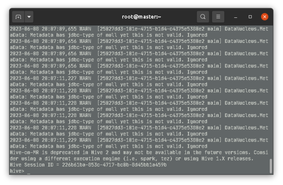
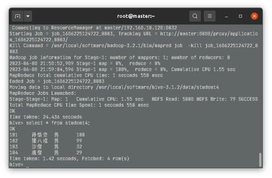

### 实验四：Hive数据类型

六、实验总结

独立完成以下任务？
有以下数据集partitions.txt:
zs age:28,salary:20000,address:beijing
ls age:25,salary:10000,address:sh
as age:30,salary:30000,address:sz
fs age:24,salary:8000,address:sz
(1)请选择合适的数据类型创建Hive表
(2)导入本地数据集到Hive表
(3)查看表中的数据集
请按以下格式输出实验报告：
Hive数据类型练习
姓名：
学号：
实验步骤：

1. 启动 hive

```bash
start-all.sh
zk start
hive
```



2. 创建表

```hive
create table partitions(name string,score map<string,string>)
ROW FORMAT DELIMITED
FIELDS TERMINATED BY ' '
COLLECTION ITEMS TERMINATED BY ','
MAP KEYS TERMINATED BY ':';
```

3. 导入数据

```hive
LOAD DATA LOCAL INPATH '/usr/local/software/hive-3.1.2/data/partitions.txt' OVERWRITE INTO TABLE partitions;
```

4. 查询表

```hive
select * from partitions;
```


注意事项:
(4)必须包含hive启动成功截图
(5)必须包含hive建表的语句
(6)必须包含查询表中数据的截图

### 实验五：数据定义操作DDL

六、实验总结
独立完成以下任务
有学生(学号，姓名，性别，年龄)数据集如下，请完成以下任务：
101,孙悟空,男,100
102,猪八戒,男,99
103,沙僧,男,32
104,唐僧,男,29
(1)创建班级数据库class
(2)修改数据库的modifier为bigdata，并查看数据库详细信息
(3)创建学生表student并从本地导入相关数据集
(4)复制学生表student为student1
(5)清空student表数据集并删除student1表
truncate table student;
drop table student1 cascade;

请按以下格式输出实验报告
HiveQL应用:数据DDL操作演练
姓名：
学号：
实验步骤：

1. 启动 hive

```bash
start-all.sh
zk start
hive
```


2. 创建班级数据库class

```hive
CREATE DATABASE class;
```

3. 修改数据库的modifier为bigdata，并查看数据库详细信息

```hive
use class;
alter database class set dbproperties ('modifier'='bigdata');
desc database extended class;
```

4. 创建学生表student并从本地导入相关数据集

```hive
CREATE TABLE student(id int ,name string,sex string,age int)
ROW FORMAT DELIMITED
FIELDS TERMINATED BY ','
COLLECTION ITEMS TERMINATED BY ',';

LOAD DATA LOCAL INPATH '/usr/local/software/hive-3.1.2/data/student.txt' OVERWRITE INTO TABLE student;
```

5. 复制学生表student为student1

```hive
create table student1 as select * from student;
```

6. 清空student表数据集并删除student1表

```hive
truncate table student;
drop table student1 cascade;
```

注意事项:
(6)必须包含hive启动成功截图
(7)必须包含hive创建class数据库的语句
(8)必须包含hive创建student数据表的语句
(9)必须包含hive创建student1表的语句
(10)必须包含清空表与删除表的语句

### 实验六：数据操作DML

六、实验总结
独立完成以下任务
有学生(学号，姓名，性别，年龄)数据集如下，请完成以下任务：
101,孙悟空,男,100
102,猪八戒,男,99
103,沙僧,男,32
104,唐僧,男,29
(1)创建班级数据库class
(2)将数据集上传到HDFS文件系统
(3)创建学生表student3并从HDFS导入相关数据集
(4)通过查询语句查询学生表student3并创建学生表student4
(5)将student4表中的数据格式化导出到本地
请按以下格式输出实验报告：
HiveQL应用:数据DDM操作演练
姓名：
学号：
实验步骤：

1. 启动 hive

```bash
start-all.sh
zk start
hive
```


2. 创建班级数据库class

```hive
CREATE DATABASE class;
```

3. 将数据集上传到HDFS文件系统

```
hadoop fs -mkdir -p /usr/hive/data/class
hadoop fs -put /usr/local/software/hive-3.1.2/data/student.txt /usr/hive/data/class
```

4. 创建学生表student3并从HDFS导入相关数据集

```hive
CREATE TABLE student3(id int ,name string,sex string,age int)
ROW FORMAT DELIMITED
FIELDS TERMINATED BY ','
COLLECTION ITEMS TERMINATED BY ',';

load data inpath '/usr/hive/data/class/student.txt' into table student3;
```

5. 通过查询语句查询学生表student3并创建学生表student4

```hive
create table student4 as select * from student3;
select * from student4;
```


6. 将student4表中的数据格式化导出到本地

```hive
insert overwrite local directory '/usr/local/software/hive-3.1.2/data/student4' row format delimited fields terminated by '\t' select * from student4;
```



注意事项:
(6)必须包含hive启动成功截图
(7)必须包含hive创建student3与student4数据表的语句
(8)必须包含查询student4表数据的截图
(9)必须包含hive导出student4表的语句